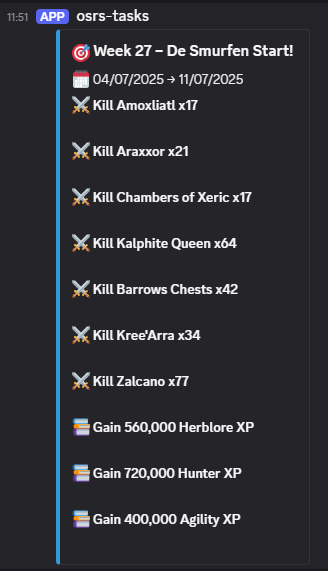
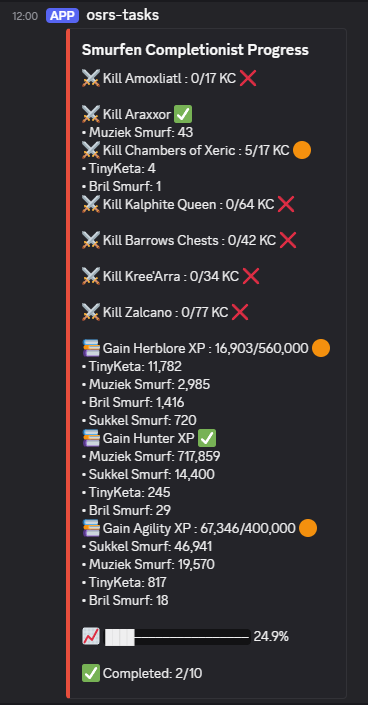
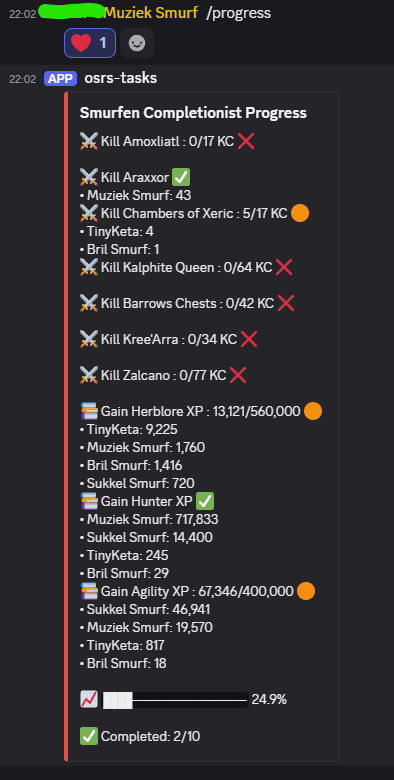
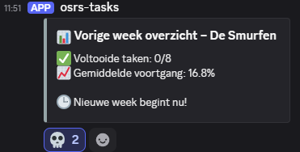

# 🎯 'De Smurfen' Weekly Challenges

An automated Discord bot for OSRS communities that generates weekly challenges and tracks your group's progress. Built for fun, motivation, and community growth.

> ⚠️ This project is still in early development. Bugs may occur, and features are subject to change.

Screenshots below!
---

## 📙 Author's Note

Hi there! 

My friends and I have an OSRS Group Ironman team called **"De Smurfen"**. We built this bot to add a bit of structure and purpose to our grinds. After a few weeks of on-and-off coding, we came up with something we really enjoy using — and we hope you will too.

The concept is simple: weekly challenges that encourage teamwork, progression, and a healthy grind mindset. We're already dreaming of future features like:

- a database to track progress over multiple weeks,
- monthly challenges,
- clue scroll support,
- and much more!

This is my first public project on GitHub, so feel free to guide me and help turn this into something great. I welcome all feedback, feature requests, and community contributions. 

Let's build something awesome together. 💙

Kind regards,

_Author: Sukkel Smurf aka Shmirre_

_Contributors: Muziek Smurf aka Pikkie, Bril Smurf aka Kev_

---

## 🤔 What Does It Do?

This bot generates weekly tasks for your OSRS group based on XP/hour and kills/hour values. It fetches player stats from the official hiscores and adjusts goals dynamically based on your group size.

Some key mechanics:

- ⏳ Assumes 2 hours of play per day, 6 days per week, multiplied by your group's size.
- ⚔️ Boss kill goals are based on each boss's kills/hour value, scaled by estimated play time.
- 🧠 Skill XP goals are calculated using defined XP/hour rates and total available hours.
- 🎯 Goals are generated using a weighted random selection with support for mandatory tasks.
- 👥 Only the listed players in `PLAYERS` are considered for progress tracking.
- 🔁 Hiscores are checked weekly and daily to track progress and calculate completions.
- 📊 Weekly summaries and progress bars are auto-posted to visualize team progress.
- 🧩 Boss and skill pools are fully configurable through `JSON`.

You can tweak the task difficulty, adjust the playtime assumptions, or expand the task pool to fit your group’s playstyle.

---

## ⚙️ Features

- 🔁 **Weekly Task Generation** — Randomized boss kill and skill XP tasks.
- 🗕️ **Scheduled Reports** — Weekly summaries and daily progress updates.
- 🔎 **OSRS Hiscore Tracking** — Fetches XP and boss kills via official hiscores.
- 🧩 **Configurable & Extensible** — Tweak your bosses and skills via JSON.
- 🌍 **Community-Driven** — Open source, open ideas.

---

## 📦 Setup Instructions

If you want to create your own version of the bot, follow these steps:

1. **Create a Discord bot** via the [Discord Developer Portal](https://discord.com/developers/applications)
   - Authorize it with the necessary bot permissions, including:
     - `Send Messages`
     - `Read Message History`
     - `Embed Links`
     - `Use Slash Commands`

2. **Paste your bot token** directly into the code (e.g., `TOKEN = 'your-token-here'`).

3. **Set your Discord channel ID** by replacing `CHANNEL_ID` in the script with the ID of the channel where the bot will post.

4. **Add your OSRS player names** to the `PLAYERS` list in `bot.py`.

5. **Install required modules**:
```bash
pip install -r requirements.txt
```

6. **Run the bot locally**:
```bash
python bot.py
```

7. *(Optional)* You can also choose to **host the bot online**, for example using Docker or a cloud server.

---

## 📃 Available Commands

Once the bot is running, these commands are available:

| Command             | Description                                                    |
|--------------------|----------------------------------------------------------------|
| `/startweek`       | Generates a new week with randomized challenges (admin only).  |
| `/simulate_week`   | Simulates the weekly rollover + generation (for testing).      |
| `/starttestweek`   | Starts a test week with hardcoded tasks.                      |
| `/progress`        | Displays current progress for the ongoing challenge week.     |
| `/hiscore_bosses`  | Logs all bosses returned from the hiscore API (debug use).    |
| `/check_boss_matches` | Checks if your configured bosses match with OSRS API data. |

> ❗ Some commands like `/startweek` regenerate tasks and should be used with caution, especially in public or large servers.

---

## 🚛 Docker Support (optional)

You can also build and run the bot with Docker:

```bash
docker build -t smurfen-bot .
docker run smurfen-bot
```

---

## 🛠️ Directory Structure
```
smurfen-weekly-bot/
├── bot.py
├── config/
│   ├── smurfen_bosses.json
│   └── skills.json
├── Dockerfile
├── README.md
└── CONTRIBUTING.md
```
## 🖼️ Preview – Bot In Action

Here are some examples of how the bot looks inside Discord:

### 🆕 Weekly Challenge Announcement


---

### 📊 Daily Progress Update at 12


---

### 📊 Daily Progress triggered by a player in discord with the '/progress' command


---

### 📈 Summary of Completed Tasks


---

## 🤝 Want to Contribute?
We'd love to have you! Check out [CONTRIBUTING.md](CONTRIBUTING.md) for details.

---

## 📞 License
This project is licensed under the MIT License. See the LICENSE file for details.